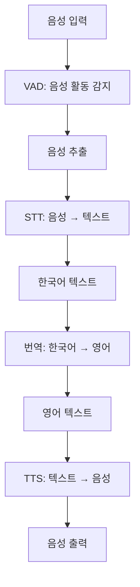

[프로젝트 설명 파일 보기](https://drive.google.com/file/d/1Fw-bbipn3Cj4GeHUeOwkhhn4BQtSPsLS/view?usp=drive_link)

# KDT 음성 처리 프로젝트

[](https://www.python.org/)
[](https://opensource.org/licenses/MIT)
[]()

이 프로젝트는 음성 활동 감지(VAD), 음성 인식(STT), 텍스트 번역, 텍스트 음성 변환(TTS)을 포함한 음성 처리 파이프라인을 구현합니다.

## 🎯 기능

- **VAD (Voice Activity Detection)**: 실시간으로 음성 활동을 감지하여 음성 부분만 추출
- **STT (Speech-to-Text)**: 한국어 음성을 텍스트로 변환
- **번역 (Translation)**: 한국어 텍스트를 영어로 번역
- **TTS (Text-to-Speech)**: 영어 텍스트를 음성으로 변환하여 출력

## 📊 워크플로우



## 📁 파일 설명

### stt.py
> **🔊 실시간 음성 녹음 및 처리 모듈**
실시간 음성 녹음 및 처리 모듈입니다.
- Silero VAD 모델을 사용하여 음성 활동을 감지
- 10초 동안 녹음하며, 음성 부분만 추출하여 `vad_recorded.wav` 파일로 저장
- Google Speech Recognition을 사용하여 한국어 음성을 텍스트로 변환

### tts.py
> **🗣️ 텍스트 음성 변환 모듈**
텍스트 음성 변환 모듈입니다.
- 입력 텍스트를 영어로 번역
- Google Text-to-Speech (gTTS)를 사용하여 영어 텍스트를 음성으로 변환
- 스피커를 통해 음성을 출력

### vad.py
> **🎙️ 음성 활동 감지 전용 모듈**
음성 활동 감지 전용 모듈입니다.
- Silero VAD 모델을 사용하여 실시간 음성 감지
- 음성 시작과 종료를 감지하여 출력

### translate.py
> **🌐 텍스트 번역 모듈**
텍스트 번역 모듈입니다.
- Google Translator를 사용하여 텍스트 번역
- 한국어에서 영어로의 번역 지원

### total.py
> **🔄 전체 음성 처리 파이프라인 통합 모듈**
전체 음성 처리 파이프라인을 통합한 모듈입니다.
- VAD → STT → 번역 → TTS의 전체 흐름을 실행

### requirement.txt
> **📦 프로젝트 의존성 패키지 목록**
프로젝트에 필요한 Python 패키지 목록입니다.

## 🚀 설치 방법

1. Python 환경을 준비하세요 (권장: Python 3.8 이상)
2. 필요한 패키지를 설치하세요:

```bash
pip install -r requirement.txt
```

## 📖 사용 방법

### 개별 모듈 실행

1. **VAD 실행**:
   ```bash
   python vad.py
   ```

2. **STT 실행**:
   ```bash
   python stt.py
   ```

3. **전체 파이프라인 실행**:
   ```bash
   python total.py
   ```

### ⚠️ 주의사항

- 마이크 권한이 필요합니다.
- 인터넷 연결이 필요합니다 (Google 서비스 사용).
- 녹음 시간은 stt.py에서 `RECORD_SECONDS` 변수로 조정 가능합니다.

## 📚 의존성

- torch
- sounddevice
- numpy
- soundfile
- speech_recognition
- gtts
- pydub
- deep_translator
- IPython (선택적)
